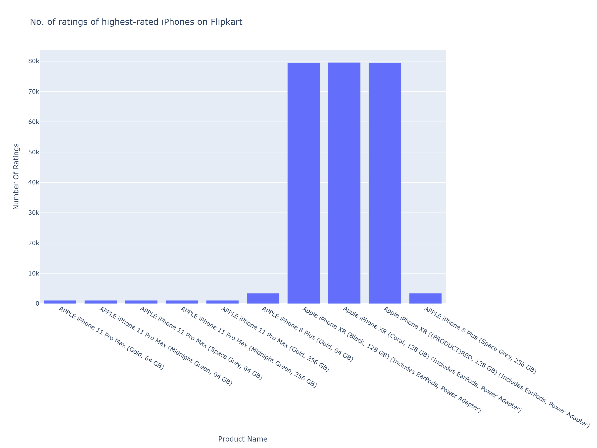
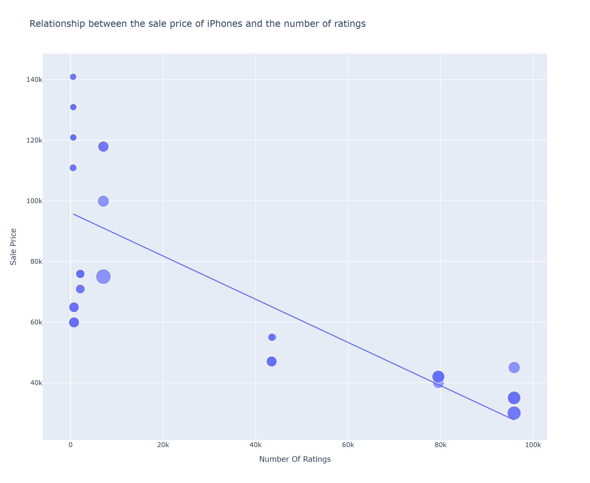

# iPhone Sales Analysis on Flipkart

## Project Overview
This project involves an in-depth analysis of iPhone sales data scraped from Flipkart. The goal was to clean, explore, and visualize the data to uncover patterns and relationships between price, discounts, and customer ratings.

## Tools & Technologies
- **Language:** Python
- **Libraries:** Pandas, NumPy, Plotly, Jupyter Notebook
- **Concepts:** Data Cleaning, Exploratory Data Analysis (EDA), Data Visualization

## Key Steps & Insights
1.  **Data Cleaning:** The dataset contained 62 products with no missing values, ensuring a robust analysis.
2.  **Top-Rated iPhones:** Identified and visualized the top 10 highest-rated iPhone models on the platform.
3.  **Price vs. Ratings Analysis:** Discovered a trend suggesting that more affordable iPhones tend to receive a significantly higher volume of ratings.
4.  **Discount Impact:** Explored the relationship between discount percentages and customer engagement.
5.  **Price Extremes:** Located the most expensive iPhone (iPhone 12 Pro 512GB at ₹140,900) and the least expensive (iPhone SE 64GB at ₹29,999).

## Code Snippet: Example Visualization
```python
# Relationship between Sale Price and Number of Ratings
figure = px.scatter(data_frame=data,
                   x='Number Of Ratings',
                   y='Sale Price',
                   trendline='ols',
                   title='Relationship between Sale Price and Number of Ratings')
figure.show()
```

markdown

## Key Steps & Insights

### 1. No. of ratings of highest-rated iPhones on Flipkart
Identified the highest-rated models. The iPhone XR variants consistently received the highest ratings.



### 2. Relationship between Sale Price and Number of Ratings
Discovered a strong inverse correlation – more affordable iPhones generate a significantly higher volume of customer ratings.

```python
figure = px.scatter(data_frame=data, x='Number Of Ratings', y='Sale Price', trendline='ols')
figure.show()
```

